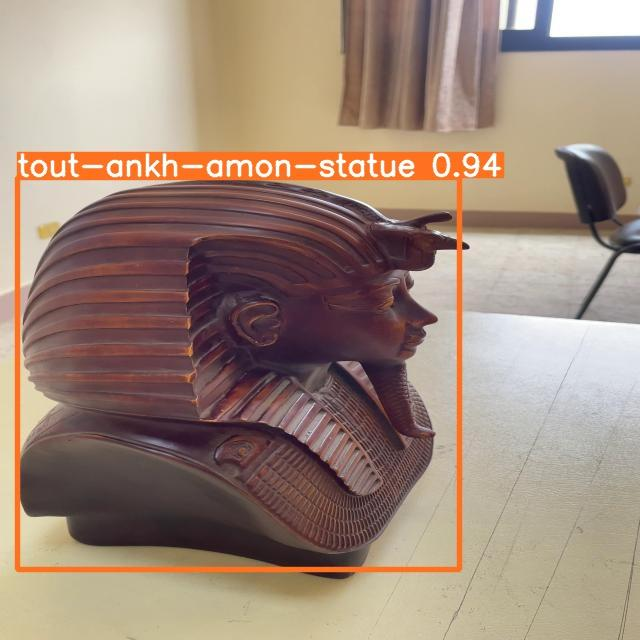

## Vision Transformer for Statue Classification

[](https://opensource.org/licenses/MIT)
[](https://www.python.org/downloads/release/python-380/)
[](https://github.com/John-Wassef/Vision-Transformer/issues)
[](https://github.com/John-Wassef/Vision-Transformer/stargazers)

### Description

This repository contains the code and data for a Vision Transformer model designed to classify statues. The dataset includes images of three distinct classes: the Nefertiti statue, the Tutankhamun statue, and the Alexander the Great statue. This project was a part of my graduation project, focusing on applying Vision Transformer models for image classification tasks.

### Dataset

The dataset consists of images of three different statues:
- **Nefertiti Statue**
  
- **Tutankhamun Statue**
  
- **Alexander the Great Statue**
  

### Results

Here are some classification results using the Vision Transformer model:
- **Nefertiti Statue Classification**
  
- **Tutankhamun Statue Classification**
  
- **Alexander the Great Statue Classification**
  

### Table of Contents

- [Features](#features)
- [Installation](#installation)
- [Usage](#usage)
  - [Training](#training)
  - [Inference](#inference)
- [Examples](#examples)
- [Contributing](#contributing)
- [License](#license)
- [Contact](#contact)

### Features

- Implementation of the Vision Transformer model.
- Training scripts with configurable hyperparameters.
- Data preprocessing utilities for statue images.
- Example notebooks demonstrating training and inference.
- Pre-trained model weights for quick evaluation.

### Installation

1. Clone the repository:

    ```bash
    git clone https://github.com/John-Wassef/Vision-Transformer.git
    cd Vision-Transformer
    ```

2. Create a virtual environment and activate it:

    ```bash
    python3 -m venv venv
    source venv/bin/activate
    ```

### Usage

#### Training

To train the Vision Transformer model, you can use the provided training script by configuring the parameters in the script as per your dataset and requirements.

#### Inference

For inference, you can use the provided inference script to classify new images based on the trained model.

### Examples

Check the `examples` directory for Jupyter notebooks demonstrating how to train and evaluate the Vision Transformer model.

### Contributing

Contributions are welcome! Please open an issue or submit a pull request with your improvements and fixes.
